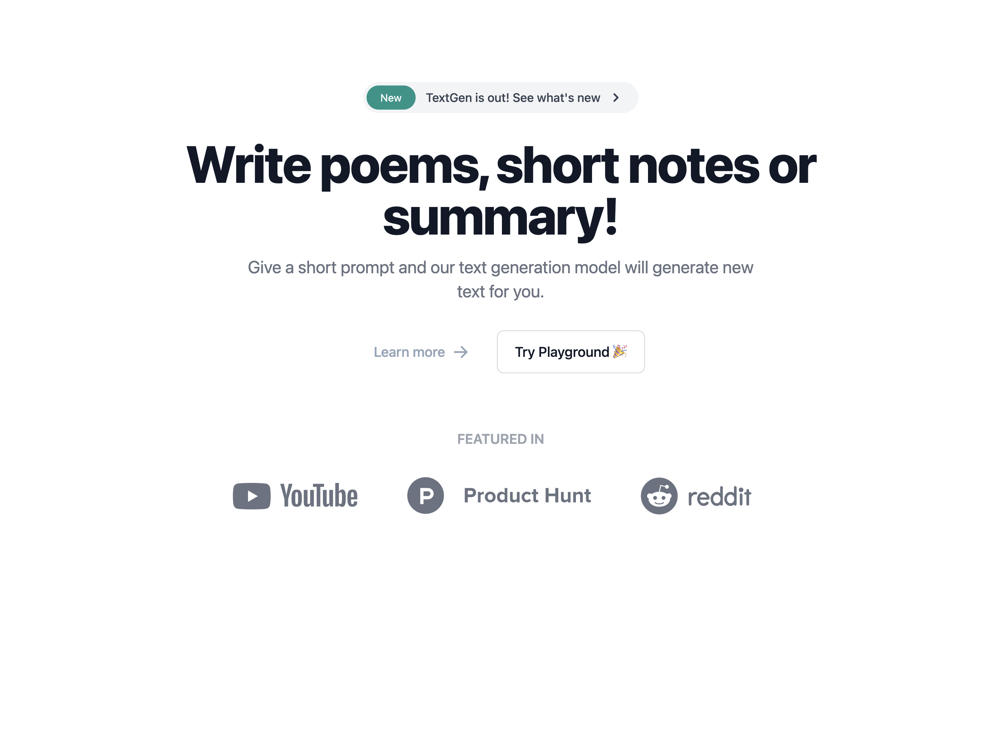
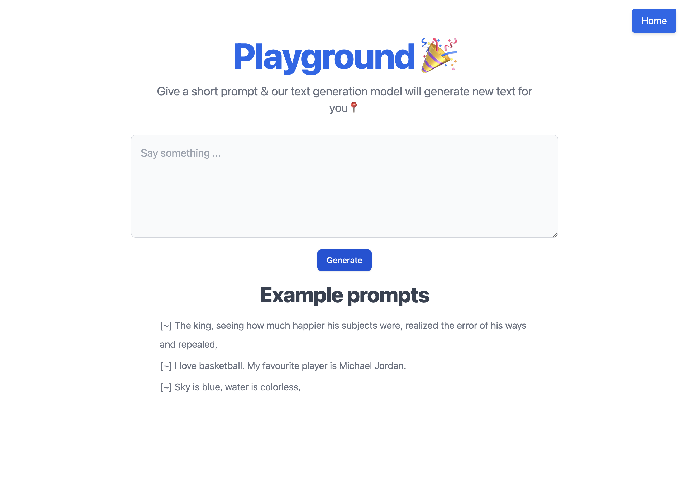
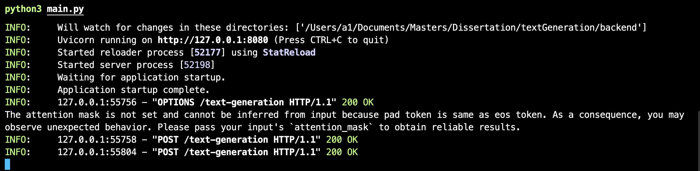

# Text Generation Web App: React + HuggingFace 🤗

Text Generation application backed by OpenAI's gpt2 model.

# Tech Stack

- **Frontend** - Vite-React, TypeScript, Shadcn
- **Backend** - FastAPI, PyTorch, HuggingFace

# Home page

# Application Playground

# Text Generation Response Displayed

### Backend API Calls

